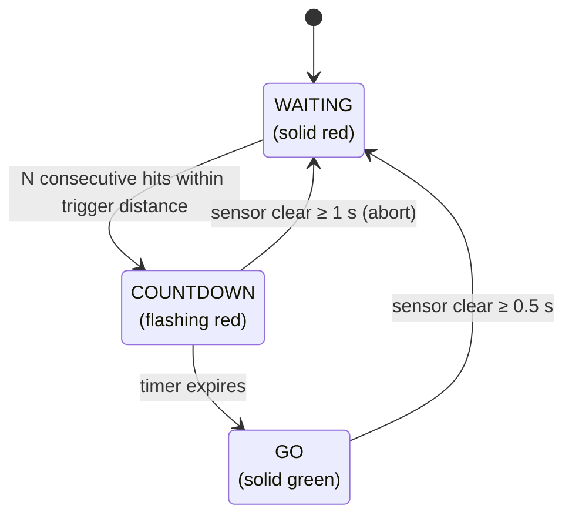

# Arduino Traffic Light Controller

A PlatformIO project for an Arduino Uno that powers the traffic light system used at my local go-kart weekly league.

## Overview

Two independent traffic light channels (A and B) each use an HC-SR04 ultrasonic sensor to detect a kart arriving at the front of a pit bay. The sensor triggers a stop countdown; when the countdown expires the light turns green, authorising the kart to leave. Settings are adjustable at runtime via an analog keypad and shown on a 16×2 LCD.

---

## State machine

The sensor is at the **entrance** of the bay. The kart trips it on the way in, triggering a stop countdown. When the countdown expires the light goes green, authorising the kart to leave. The system returns to red once the kart has fully cleared the sensor.



| State | Light | Condition to leave |
|---|---|---|
| **WAITING** | Solid red | `SENSOR_TRIGGER_COUNT` consecutive hits within trigger distance → **COUNTDOWN** |
| **COUNTDOWN** | Flashing red (1 Hz) | Timer expires → **GO**; or sensor clear ≥ 1 s → **WAITING** (abort) |
| **GO** | Solid green | Sensor clear ≥ 0.5 s → **WAITING** |

---

## Sensor scheduling

To prevent cross-talk between the two HC-SR04 sensors, only one sensor is pinged per loop slot, alternating A → B → A → B. The next slot is scheduled from `millis()` *after* the blocking `pulseIn` call completes, so the gap between pings is always at least `SENSOR_PING_INTERVAL` of real elapsed time regardless of echo duration. The trigger filter (`SENSOR_TRIGGER_COUNT`) increments only on a fresh reading, not on every loop iteration.

---

## Hardware

- **Microcontroller:** Arduino Uno
- **Sensors:** 2× HC-SR04 ultrasonic distance sensors (one per channel)
- **Output:** Relays controlling the red and green lights for each channel
- **Display:** 16×2 LCD (direct pin wiring via hd44780)
- **Input:** Analog keypad (single resistor-ladder on A0)

### Pin assignments

| Signal | Pin |
|---|---|
| Channel A — trig | 11 |
| Channel A — echo | 12 |
| Channel A — green relay | A5 |
| Channel A — red relay | A4 |
| Channel B — trig | 2 |
| Channel B — echo | 3 |
| Channel B — green relay | A3 |
| Channel B — red relay | A2 |
| LCD RS / EN / DB4–DB7 | 8 / 9 / 4–7 |
| Keypad | A0 |

### LCD layout

```
SA:<status>  D:<cm>
SB:<status>  T:<s>
```

`<status>` is the live sensor distance (cm) in WAITING, `ST-N` (seconds remaining) during COUNTDOWN, or `GO` when the kart is cleared to leave. `D:` and `T:` show the current trigger distance and timer duration.

### Keypad buttons

| Button | Action |
|---|---|
| RIGHT | Increase trigger distance |
| LEFT | Decrease trigger distance |
| UP | Increase timer duration |
| DOWN | Decrease timer duration |

---

## Key constants (`src/main.cpp`)

| Constant | Default | Description |
|---|---|---|
| `SENSOR_PING_INTERVAL` | 20 ms | Minimum gap between sensor pings (cross-talk prevention) |
| `SENSOR_TRIGGER_COUNT` | 3 | Consecutive hits required to leave WAITING |
| `GREEN_CLEAR_DEBOUNCE` | 500 ms | Sensor must be clear this long before returning to WAITING from GO |
| `COUNTDOWN_CLEAR_TIMEOUT` | 1000 ms | Sensor clear during COUNTDOWN aborts back to WAITING |
| `DEFAULT_DISTANCE` | 100 cm | Initial trigger distance |
| `DEFAULT_DURATION` | 10 s | Initial countdown timer |
| `DISTANCE_MAX` | 150 cm | Maximum adjustable trigger distance |
| `RED_DURATION_MAX` | 120 s | Maximum adjustable timer duration |

---

## Dependencies

Managed via PlatformIO (`platformio.ini`):

| Library | Purpose |
|---|---|
| `hd44780` | LCD driver |
| `PinChangeInterrupt` | Pin-change ISR for keypad |
| `LiquidCrystal` / `LiquidCrystal_I2C` | LCD compatibility |

## Building & Flashing

```bash
pio run -e uno_front -t upload
```
